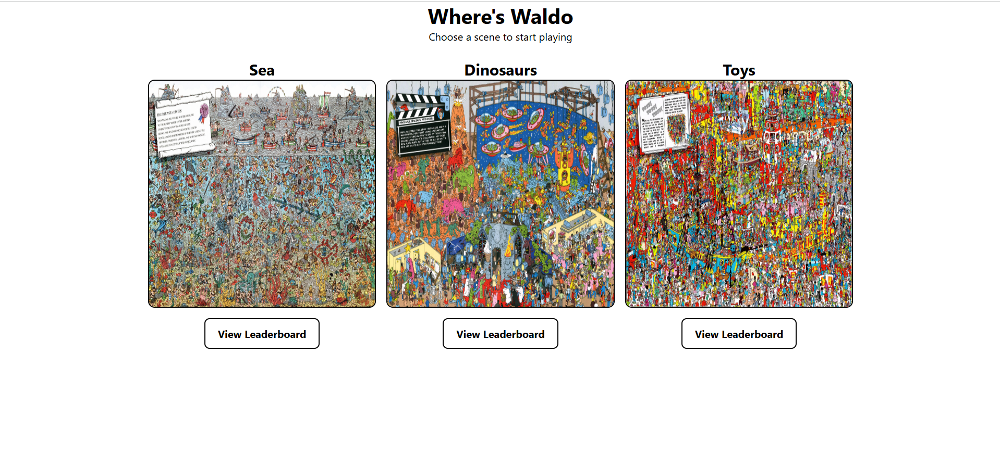
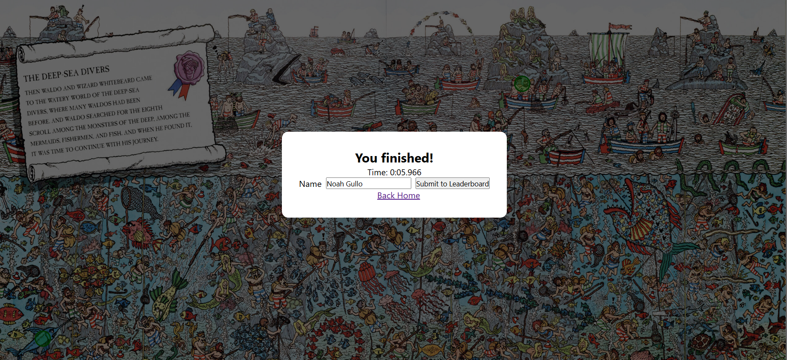

# Where's Waldo
## Live Demo
[Play the Live Demo](https://where-is-waldo-production-deaa.up.railway.app/)

## Description
A web application that implements a similar game to [Where's Waldo/Wally](https://en.wikipedia.org/wiki/Where's_Wally%3F). Pick a large illustrated scene and find three characters to win. Compete with others for the fastest time on the leaderboard!

## Screenshots

### Game Selection

  

### Gameplay

 

### Game Over

 

## Core Features
- Interactive Where's Waldo/Wally gameplay. Users can select characters and receive immediate feedback on whether their selection was correct.
- Multiple game boards. Separate scenes each with their own unique characters to find.
- Server-side coordinate verification. Character locations are stored in a PostgreSQL database and verified by an Express backend.
- JWT-based game timing and validated leaderboard submissions. The backend calculates completion times using signed game tokens, and completed runs receive a signed result token containing the validated time and specific board.

## Tech Stack
| Area           | Technologies                            |
| -------------- | --------------------------------------- |
| **Frontend**   | React, React Router, Vite, CSS          |
| **Backend**    | Node.js, Express, JSON Web Tokens (JWT) |
| **Database**   | PostgreSQL, Prisma ORM                  |
| **Deployment** | Railway                                 |

## API
| Method | Endpoint              | Description                                                     |
| ------ | --------------------- | --------------------------------------------------------------- |
| `POST` | `/game`               | Starts a game and issues a signed game token                    |
| `POST` | `/check`              | Verifies a character selection                                  |
| `POST` | `/game/finish`        | Calculates the completion time and issues a signed result token |
| `POST` | `/leaderboard`        | Submits a completed run to the leaderboard                      |
| `GET`  | `/leaderboard/:board` | Retrieves leaderboard times for a specific board                |

## Reflection
This project was a ton of fun. I got the chance to create a full-stack project that developed into a fun, interactive experience. Watching the project grow as I added new features and functionality was really rewarding, especially figuring out how to verify game data on the server without trusting values provided by the client. In the backend, I followed REST-style principles by exposing resource-oriented HTTP endpoints and separating routing, controller logic, and database access to maintain separation of concerns.

## Credits
All "Where's Waldo/Wally" images were sourced from [Jourdan Rembough](https://vuss.io/author/jourdanrombough/) at [vuss.io](https://vuss.io/high-resolution-wheres-waldo-images/)